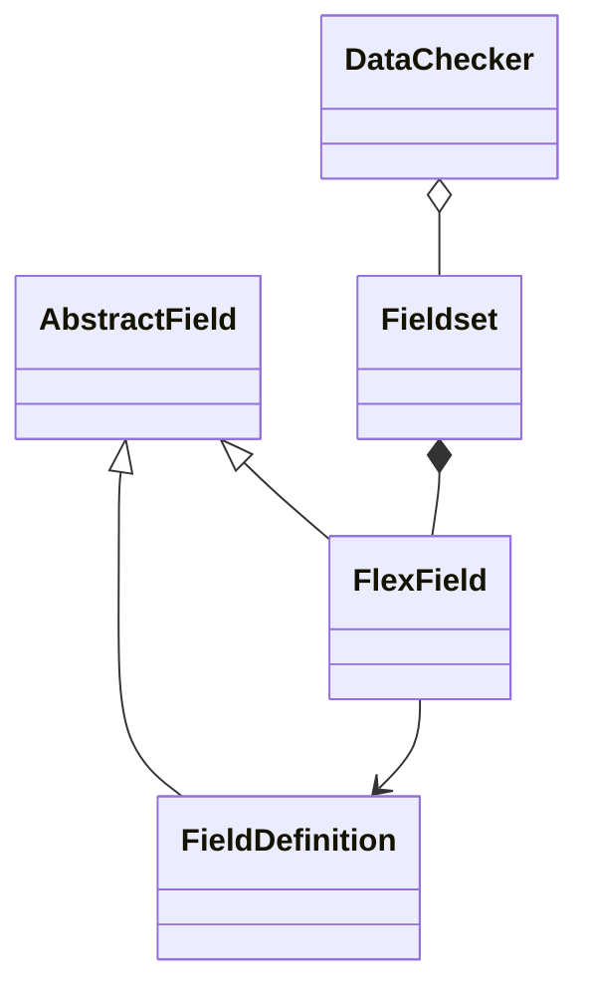

# HOPE FlexFields

This library provides the ability to define a set of fields and related validation rules dynamically. It has been designed as part of the [HOPE](https://github.com/unicef/hct-mis) project to manage user-customizable fields (FlexField). The idea is to have a central business logic repository for data import validation.

It provides four classes:

- FieldDefinition: This represents a collection of reusable pre-configured fields
- FlexField: Instance like representation of `FieldDefinition` inside a `Fieldset`
- Fieldset: Group of FlexField
- DataChecker: Compound of fieldset

From the design point of view a high level comparison with Django components could be:

- `FieldDefinition` = `class forms.Field`
- `Fieldset` = `forms.Form`
- `FlexField` = `forms.Field()`
- `DataChecker` = `[forms.Form(),...]`

... and some utilities

- Automatic creation of FieldSets inspecting [exiting models](http://localhost:8000/hope_flex_fields/fieldset/create_from_content_type/?)
- Automatic creation of XLS file matching an existing [Datachecker](http://localhost:8000/hope_flex_fields/datachecker/)
- Validate XLS against an existing [Datachecker](http://localhost:8000/hope_flex_fields/datachecker/)

## Install
    CSP_SCRIPT_SRC = [
        ...
        "cdnjs.cloudflare.com",
    ]

    INSTALLED_APPS = [
        ...
        'admin_extra_buttons',
        'jsoneditor',
        'hope_flex_fields',
    
    ]

## Demo Application

    python manage.py migrate
    python manage.py demo
    python manage.py runserver

Navigate to http://localhost:8000/admin/ and login using any username/password
